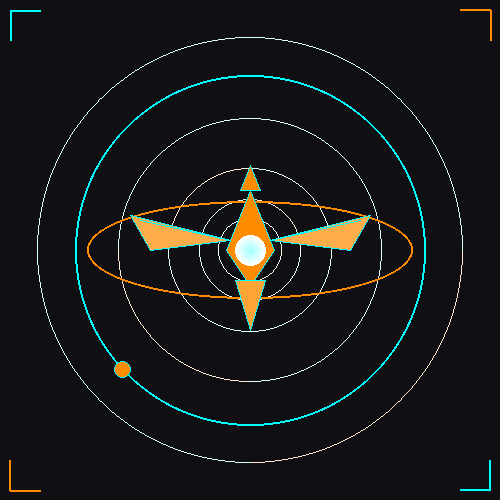

# skh-flamelang-StrategicKhaos-prefix-

FlameLang v2.0.0 sovereign compiler toolchain. 5-layer transformation pipeline (English→Hebrew→Unicode→Wave→DNA→LLVM). Biological compilation, physics-validated dimensional analysis, native quantum primitives. Part of StrategicKhaos Swarm Intelligence.

## 🎨 Branding

The official Strategickhaos trademark logo is available in this repository:
- **[strategickhaos-logo.png](strategickhaos-logo.png)** - For GitHub OAuth and web use
- **[strategickhaos-logo.jpg](strategickhaos-logo.jpg)** - Alternative JPEG format
- **[LOGO.md](LOGO.md)** - Complete design documentation and usage instructions
- **[logo-preview.html](logo-preview.html)** - Visual preview

The logo features the Toruk silhouette, Node 137 orbital rings, and sacred geometry in bio-luminescent cyan and toruk orange.
